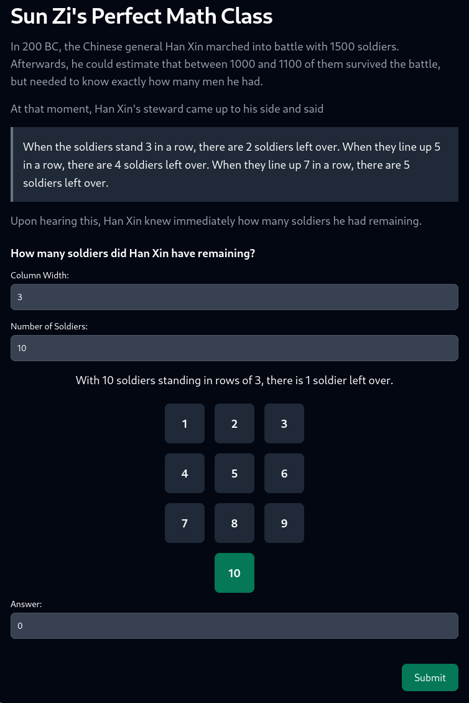
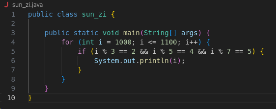
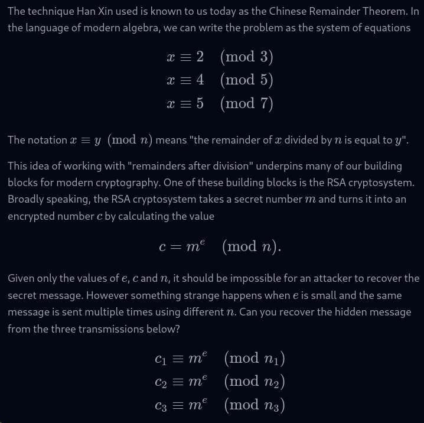
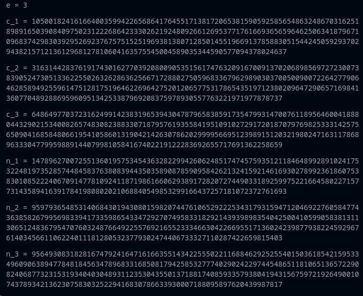

**Challenge Description:** Everybody, Sunzi's math class is about to begin!!!


**Solving Process:** We're given a URL to visit, which explains the challenge in more detail. I'll include a screenshot of the site as it may be down if you're reading this later

 

Paying attention to the part that Han Xin's steward said, where ```When the soldiers stand 3 in a row, there are 2 soldiers left over. When they line up 5 in a row, there are 4 soldiers left over. When they line up 7 in a row, there are 5 soldiers left over.``` Seems as though this could be some math, where we need to find a value that within 1000 and 1100, will satisfy the above. In other words, find `i` such that `i % 3 == 2 && i % 5 == 4 && i % 7 == 5`

Writing this in a language of your choice is pretty straight forward. I used Java and used a loop to see what the result is, which turns out to be 1034



Using the number above for the answer, we get more revealed




Doing some light reading on Chinese Remainder Theory, we can use the values above to find `m` with some Python

```Python

from sympy import *

c1 = 105001824161664003599422656864176455171381720653815905925856548632486703162518989165039084097502312226864233302621924809266126953771761669365659646250634187967109683742983039295269237675751525196938138071285014551966913785883051544245059293702943821571213612968127810604163575545004589035344590577094378024637
c2 = 31631442837619174301627703920800905351561747632091670091370206898569727230073839052473051336225502632628636256671728802750596833679629890303700500900722642779064628589492559614751281751964622696427520120657753178654351971238020964729065716984136077048928869596095134253387969208375978930557763221971977878737
c3 = 64864977037231624991423831965394304787965838591735479931470076118956460041888044329021534008265748308238833071879576193558419510910272917201870797698253331425756509041685848066195410586013190421426307862029999566951239891512032198024716311786896333047799598891440799810584167402219122283692655717691362258659
n1 = 147896270072551360195753454363282299426062485174745759351211846489928910241753224819735285744845837638083944350358908785909584262132415921461693027899236186075383010852224067091477810924118719861660629389172820727449033189259975221664580227157731435894163917841980802021068840549853299166437257181072372761693
n2 = 95979365485314068430194308015982074476106529222534317931594712046922760584774363858267995698339417335986543347292707495833182921439398983540425004105990583813113065124836795470760324876649225576921655233346630422669551713602423987793822459296761403456611062240111812805323779302474406733327110287422659815403
n3 = 95649308318281674792416471616635514342255502211688462925255401503618542159533496090638947784818456347896833168508179425853277740290242297445486511810651365722908240687732315319340403048931123530435501371881740859335793804194315675972192649001074378934213623075830325229416830786633930007188095897620439987817

N = n1 * n2 * n3
N1 = N // n1
N2 = N // n2
N3 = N // n3

M1 = mod_inverse(N1, n1)
M2 = mod_inverse(N2, n2)
M3 = mod_inverse(N3, n3)

x = (c1 * N1 * M1 + c2 * N2 * M2 + c3 * N3 * M3) % N

m = integer_nthroot(x, 3)

print(m)
```

This will print out `11564025922867522871782912815123211630478650327759091593792994457296772521676766420142199669845768991886967888274582504750347133` which when entered in the answer field gives us the flag!

**Flag:**`DUCTF{btw_y0u_c4n_als0_us3_CRT_f0r_p4rt14l_fr4ct10ns}`
