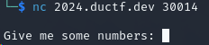
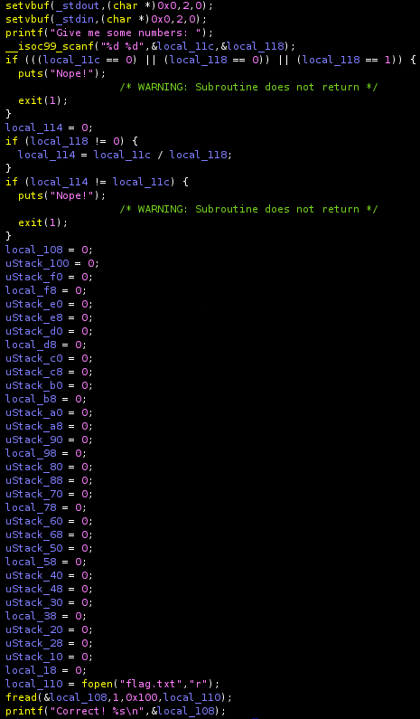
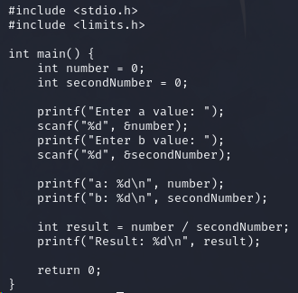
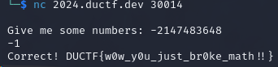

**Challenge Description:** Mash your keyboard numpad in a specific order and a flag might just pop out!

**Solving Process:** We're given an address to use netcat with, along with a binary file. If we use netcat straight away, we see that we're asked for some numbers

 

Mashing some random numbers in we get told `Nope!` and the connection closes. Maybe we should check out that binary file.

Opening it up in Ghidra, we'll go to the main function to see what's happening

Immediately we can see that we're expected to input two numbers, which are saved as `local_11c` and `local_118`. From there, if the first number is `0` or the second number is either `0` or `1` the interaction will end. We see address `local_114` initialised with a value of `0`, followed by an if block. If the second number we put in isn't `0`, `local_114` will equal our first input number divided by the second input number. The next if block compares `local_114` against `local_11c` (our first input number) and if they're *not* the same, exit. If they are the same, we'll get to the flag at the bottom.

So how are we meant to find two numbers, where the first ins't `0` and the second isn't `0` or `1`, that when divided by each other, will equal the first number?

Break math!

Specifically, we see that we're dealing with `int` values and know that given a large enough number, it'll wrap around to its negative value (normally called [integer overlow](https://en.wikipedia.org/wiki/Integer_overflow))

Rather than spamming nc requests with my guesses, I wrote some basic C to play with values until we got the right ones

Given that we want to force an overflow and we're dealing with `int`, let's play with some values around `2147483648` and `-1` for our second number

**Flag:**`DUCTF{w0w_y0u_just_br0ke_math!!}`