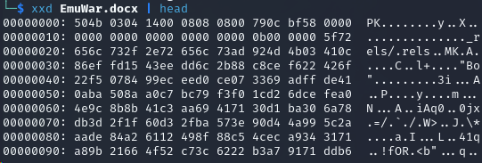

**Challenge Description:** I thought I was being 1337 by asking AI to help me solve challenges, now I have to reinstall Windows again. Can you help me out by find the flag in this document?

**Solving Process:** We're given a file labelled `EmuWar.docx` to download. If we try to use `less` we're told that it may be a binary file, which seems a bit odd

 

Let's use `xxd` combined with `head` to get the [magic numbers](https://en.wikipedia.org/wiki/List_of_file_signatures) of the file to see if the file is actually something else. Looking at the output below and checking Wikipedia, we can see that it's actually a zipped file!

 

Using `unzip EmuWar.docx` we're given a couple of folders and a few files. I went straight to `word/document.xml` and saw what I assumed was a good story (it was too long, so I didn't read). Buried inside were some commands however, specifically `curl -sL https://pastebin.com/raw/ysYcKmbu | base64 -d`. What happends if we run it?

 

**Flag:**`DUCTF{chatgpt_I_n33d_2_3scap3}`
