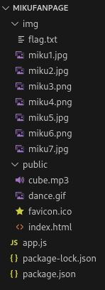
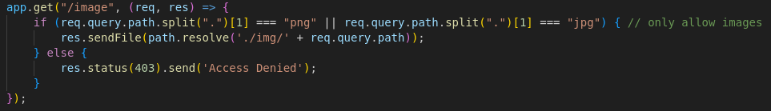
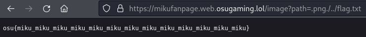

**Challenge Description:** miku <3

**Solving Process:** We're giving a website to visit (epilepsy warning) (https://mikufanpage.web.osugaming.lol/) as well as a ZIP file which when extracted, shows the structure of the website, as well as all the source code used. There is a `app.js` file, then two directories called `img` and `public`. Inside of the `img` directory are several `.jpg` and `png` files as well as `flag.txt` (unfortunately this txt file just contains a dummy flag for illustration purposes). The `public` directory has an `index.html` file and some other miscellaneous files.

It's immediately clear that we'll be paying attention to the `img` directory to retrieve that flag

 

A quick perview of `index.html` doesn't reveal anything immediately interesting, so we head to `app.js` and quickly observe that we're going to have to do some directory traversal shenanigans

To explain what's happening, our `if` conditional checks the query parameters of the request and splits the string as soon as it encounters a `"."`. Then, immediately after checks whether the proceeding input matches `png` or `jpg`. If this is true, then request will be sent to the `img` directory and allowed to continue. Basically it's a ineffective way to make sure the request is an image only (as confirmed by the comments at the end)

To get around this, we can ensure we meet the conditional by having `.png` or `.jpg` at the start of our request and then try to traverse *out* of the `img` directory (as that's where we'll be sent to), then back *in* to the directory and access the coveted `flag.txt`

**Flag:**`osu{miku_miku_miku_miku_miku_miku_miku_miku_miku_miku_miku_miku_miku}`
