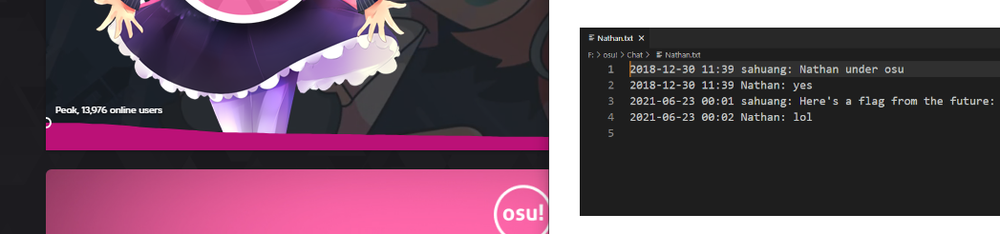

**Challenge Description:** Here's an old screenshot of chat logs between sahuang and Nathan on hollow's Windows machine, but a crucial part of the conversation seems to be *cropped out*... Can you help to recover the flag from the future?

**Solving Process:** We're given a zip file that contains a cropped PNG image. Around March 2023, news circulated about the "aCropalypse" - an exploit in screenshot editing tool on the Google Pixel and later discovered to exist on Windows 10 and 11 ( [CVE 2023-21036](https://nvd.nist.gov/vuln/detail/cve-2023-21036) and [CVE 2023-28303](https://msrc.microsoft.com/update-guide/vulnerability/CVE-2023-28303) )

Mindful of this, I immediately searched for any online tools that demonstrate this and came accross [Acropalypse](https://acropalypse.app/), however I had mixed success. Instead of giving a native screen resolution, I tried to give a resolution that should have been enough to reveal the rest of the sentence for the flag (the cropped screenshot dimensions were Width: 1047 Height: 246). This didn't generate a proper image on the website, though if I downloaded the image I received an indication I was on the right track

I could see some distinct Windows elements like the taskbar, so I was confident to keep continuing in this direction and discovered an [Acropalypse Restoration tool](https://github.com/frankthetank-music/Acropalypse-Multi-Tool) that should aid us. After getting the tool up and running, we run into the issue of the tool not running at all as the **dimensions** I'm trying might not be correct. Given that the width of the cropped image in 1047, what happens if we try common screen resolutions that exceed that, say 1920 x 1080?

**Flag:** `osu{cr0pp3d_Future_Candy<3}`