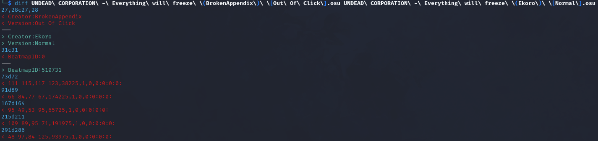

**Challenge Description:** I love playing this map but recently I noticed that some of the circles seem off. Can you help me find the **locations** of the *weird* circles?

**Solving Process:** After downloading the provided ZIP file, it appears to contain a beatmap folder that can be used in osu! itself (I don't play, so please excuse any incorrect terminology used), so I spent a ***lot*** of time messing around with the in-game editor in osu! to see if there was something further to glean.

After reaching out for a little help, the process to solve this was *much* easier than I thought. We can observe from the screenshot below that one of the files provided has a different modification date compared to the others.

We can check the [diff](https://man7.org/linux/man-pages/man1/diff.1.html)erence of the modified file and another, untouched file

After spending time investigating modifying beatmap files, I partially understood what we were looking at. These lines appeared to be the hit object syntax which follows as: `x coordinate, y coordinate, time, type, hitSound, objectParams, hitSample` (thanks to [this](https://osu.ppy.sh/wiki/en/Client/File_formats/osu_%28file_format%29) wiki explaining in depth ), which is cool and all, though not super important. The first four values of each line appear as integers, perhaps representing another value? [ASCII](https://man7.org/linux/man-pages/man7/ascii.7.html) always seems [popular](https://www.rapidtables.com/convert/number/ascii-hex-bin-dec-converter.html)

**Flag:** `osu{BTMC_15_mY_G0aT}`