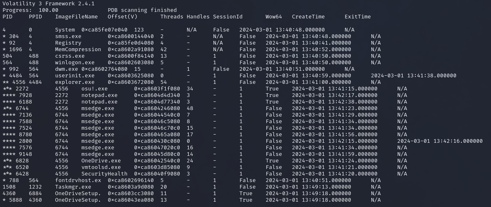
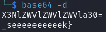
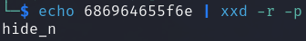

**Challenge Description:** Hey osu players, our SOC team was informed that a group of spies from Mai Corp is trying to sabotage our infrastructure via their secret map in osu!.

We were able to break into their rendezvous, but they noticed we were stealing their data and they corrupted them in time. Fortunately, we managed to acquire a full memory dump from one of their machines.

Can you help us investigate what they were trying to do?

**Solving Process:** When I see something involving a memory dump, my immediate thought is to turn to [Volatility](https://volatilityfoundation.org/) and for this challenge I made use of Volatility 3 specifically.

After downloading the provided ZIP file and extracting it, I used `windows.pstree` as I (naively) assumed we'd be dealing with a Windows memory dump. If this didn't work, we could determine the profile of the image by using `windows.info`.  I'll note that I did use `windows.pslist` first to list running processes at the time of the memory capture, however there wasn't much that I observed and as such will omit it from here.

Viewing this shorter output we can see that `osu!.exe` has been spawned, as well as `notepad.exe` twice. Being that the theme of this challenge is sabotage and my limited hyper-learning surrounding osu!, I figured it'd be worthwhile to see if there were any commands recently exectued that seemed suspicious. To do this, I used `windows.cmdline` and I specifically looked for anything relating to `notepad.exe` or `osu!.exe` itself.

Immediately on the right hand side of the two `.osu` files, the string `X3NlZWVlZWVlZWVla30=` stands out as a strong candidate as being Base64 encoded. We can immediately test this using [base64](https://linux.die.net/man/1/base64), which is native to most Linux distributions.

 

Those of you more observant might notice that there is still more yet to take from our `windows.cmdline` output from earlier. Unfortunately I skimmed over the rest of the file and spent too much time delving into rabbit holes. I eventually circled back to our two lines of output from `windows.cmdline` and looked a little closer. Is this Hexademical?

 

Finally we (or rather I) observe the start of the flag in the filename and combine all parts together

**Flag:** `osu{hide_n_seeeeeeeeeek}`