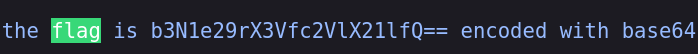

**Challenge Description:** welcome to web! there's a flag somewhere on my osu! profile...

**Solving Process:** We're given this url to investigate https://osu.ppy.sh/users/11118671 . Nothing to see on the surface, what about when we look deeper, perhaps the source? What happens when we try a cheeky `ctrl + f` to find our flag?

That's a **lot** of flags. Feels like our real flag is buried here somewhere. Since we're thinking buried, let's start from the last search result

**Flag:** `osu{ok_u_see_me}`