Initial scan with #nmap to determine what ports and services are open and available, using #-sC #-sV , using #-oA to write out in different formats. Used #xsltproc to convert the XML to HTML for ✨ beautification ✨

Note: victim IP may change due to write-up occurring over time

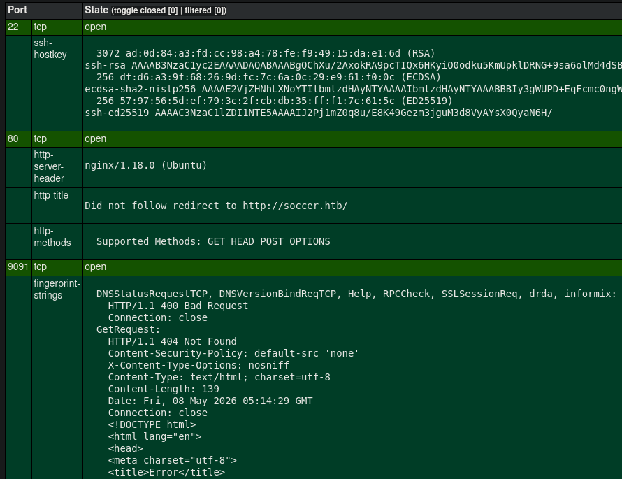

After adding the IP and hostname to #/etc/hosts , browsed to `http://soccer.htb/` to find there isn't anything immediately obvious. Should note for later that `nginx` is being used. Decided to use #ffuf to scan for VHosts and #feroxbuster for hidden directories. No immediate results on the VHost search from ffuf, though was able to discover the `/tiny/` directory from feroxbuster

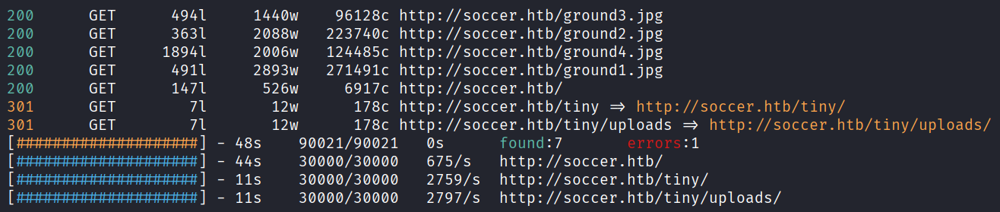

Browsing to `/tiny/` greets us with a login page. Using either the browser developer tools or Burpsuite, can notice that it's using version `2.4.3` . A link to its github repo is also included in the HTML source code. Either using a favourite search engine or looking at the documentation reveals default credentials of `admin:admin@123` or `user:12345`. While both sets of credentials work, the former immediately shows file upload capabilities, whereas the latter didn't appear to have much functionality, so `admin:admin@123` was used

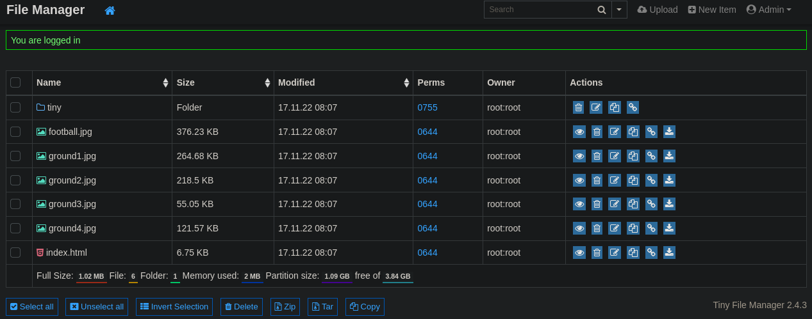

Given we have a specific version of Tiny File Manager, a quick search using a favourite search engine for a related CVE revealed file upload with RCE capabilities, found [here](https://github.com/febinrev/tinyfilemanager-2.4.3-exploit). This didn't immediately work for me and I wasn't interested in debugging, so instead used [revshells](https://www.revshells.com/) to quickly generate a PHP reverse shell. Once configured and saved locally, opted to upload the malicious PHP file via the browser, then went to view the uploaded file to trigger the reverse shell

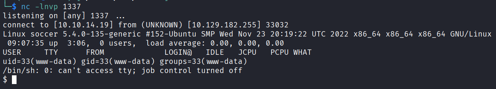

First thing is to stabilise the shell. After confirming that the victim machine had python, used `python3 -c 'import pty;pty.spawn("/bin/bash")'`, then `Ctrl + z` to send the current process to the background, then on the attacking machine used `stty raw -echo; fg` , to then finally `export TERM=xterm` on the victim machine

From the earlier `nmap` scan we saw that `nginx` is being used. Heading to `/etc/nginx/sites-available` shows us `soc-player.htb` with the following contents

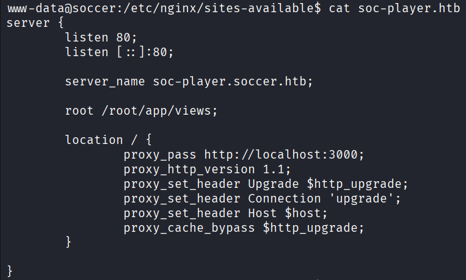

We can see that there is a VHost `soc-player` , which we can add to our `/etc/hosts` file (`soc-player.soccer.htb`) and then visit in our browser. Immediately we see some login functionality, where we're able to create an account and login. Once logged in, we're given a `Ticket Id` and potential search for other tickets

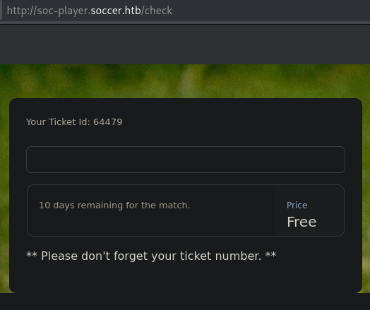

Using developer tools we can see that this is a websocket interaction. This initially wasn't being shown on Burp, though after a restart it worked fine. For this interaction, all we send is some `JSON` with a name/value pair of `"id":""`. Given that tickets here are numbers it stands to reason that we're doing a number lookup somewhere. When thinking about SQLi and pure *number* values, we have to remember that quotation marks might not be necessary. To test this, we can try `0 OR 1=1` and `"0 OR 1=1` (and/or other permutations) and compare the results

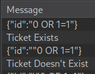

To further explore SQLi, we can use #sqlmap, though I ran into issues getting this working with the websocket, though this is more due to my unfamiliarity with sqlmap more than anything else. I found a python webserver template that I could host on my attacking machine, which was configured to pass on requests to the victim websocket, so sqlmap could send requests that way 😅 An entirely roundabout way of instead using sqlmap properly with `sqlmap -u ws://soc-player.soccer.htb:9091 --data '{"id":"0"}'`

After the initial scan confirmed SQLi and the database version (`MySQL >= 5.0.12`), it was off to the documentation of sqlmap to see what else could be done. After using `--dbs` to list all available databases and discovering `soccer_db`, I opted to immediately `--dump` the entire database. More specific initial enumeration would have allowed for faster final dump, though there was hacking to be done

Once the dump was completed, we're given a username and password for our efforts

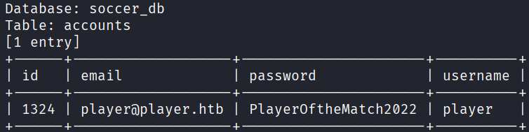

Fortunately, this username:password combination is valid for SSH access to the victim

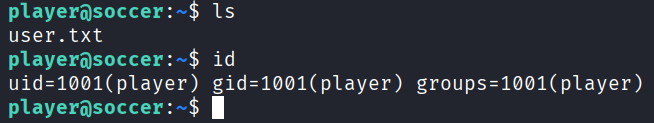

After grabbing the contents of `user.txt`, I opted to use #linpeas . After creating a directory in `/tmp` , created a python webserver on my attacking machine and grabbed `linpeas.sh` from there. NOTE: As this box is from 2022 and there have been some recent CVEs released, I intentionally ignored any suggestions from linpeas so as to solve the box as intended 

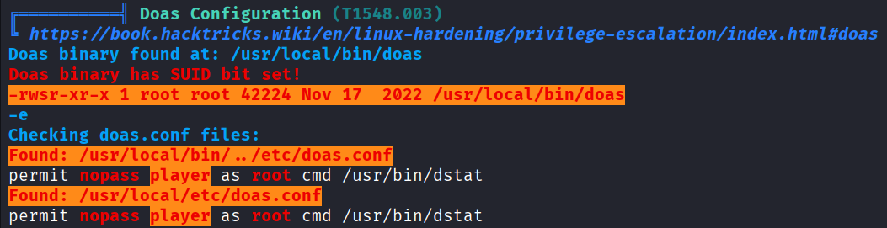

Here the vulnerability was straight forward, whereby we can run `dstat` as root through `doas`. After some searching around `dstat`, it turns out that we can create and use our own plugin. Given our ability to run `dstat` as root and that plugins are python based, a malicious plugin that generates a shell should give us root

```Python
import os

os.system("/bin/bash")
```

Place the plugin in `/usr/local/share/dstat` with the name `dstat_<NAME>.py` (as mentioned [here](https://linux.die.net/man/1/dstat#:~:text=may%20contain%20external-,dstat_,-*.py%20plugins%3A)) is needed, before finally using `doas` and escalating our privileges `doas /usr/bin/dstat --<NAME>`

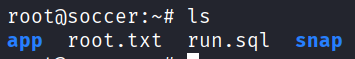
